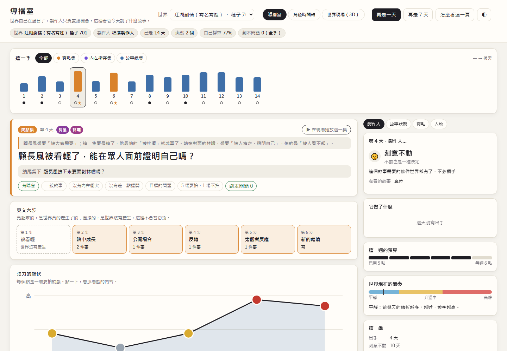
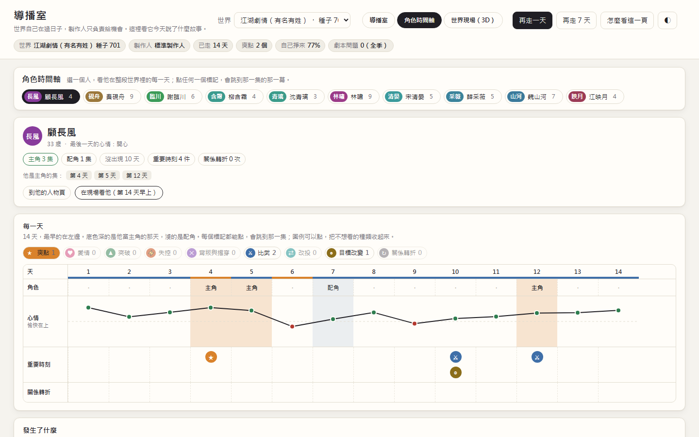
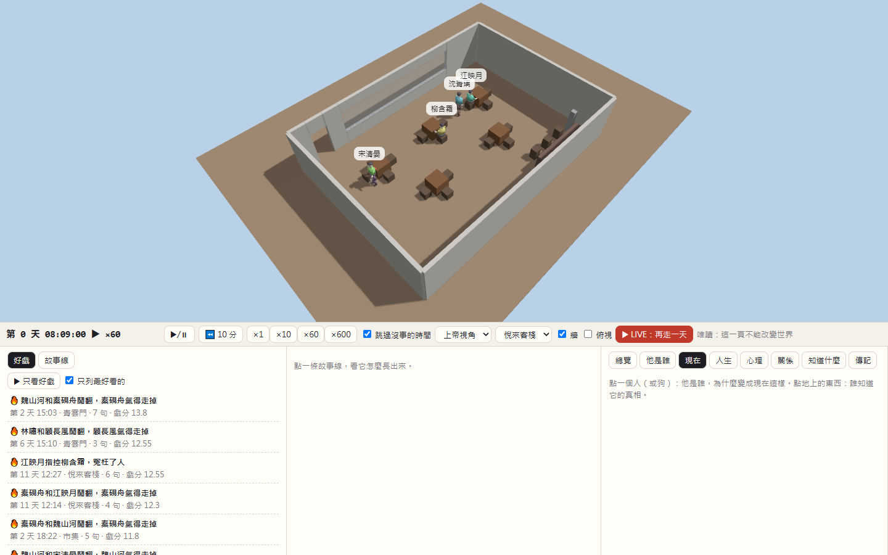
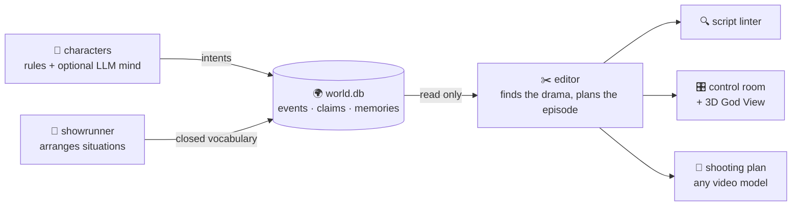

<div align="center">

# 🎬 WorldStage

### A living world that writes its own drama.

**Characters live their own lives. Nobody writes the plot. An AI showrunner finds the story — and cuts it into episodes.**

*Emergent narrative engine · multi-agent simulation · LLM characters · AI storytelling · AI video pipeline*


-f5a623)


[繁體中文簡介](#繁體中文簡介) · [Why it's different](#why-its-different) · [Quick start](#quick-start) · [How it works](#how-it-works) · [Roadmap](#roadmap)



</div>

---

## What is this?

Think ***The Truman Show***, but every person is simulated.

Ten people share a martial-arts sect (or a small modern town). Each has a wound, a want, a fear, a secret, a face, a temper. They train, gossip, lie, fall for each other, lose things, accuse the wrong person, fight duels, and canvass for the chief-disciple seat. **Nobody tells them what to do.**

On top of that world sits a crew:

| Role | What it does | What it may **not** do |
|---|---|---|
| 🌍 **The world** | Every event is recorded in one SQLite database; rules decide outcomes | — |
| 🧠 **The characters** | Choose by personality, values, memories and mood; optionally an **LLM mind** wakes at turning points | Invent actions or facts outside the world's rules |
| 🎩 **The showrunner** | Arranges *situations* — a tournament, a vacant seat, a letter | Decide anyone's choice or any outcome |
| ✂️ **The editor** | Finds the day's real drama and cuts it into an episode with a core question, a turn and a cliffhanger | Change what happened |
| 🎥 **The production line** | Turns the episode into a model-neutral shooting plan for any video model | Leak model-specific prompts upstream |

The result: stories that feel **earned**, because they actually happened.

> **阿凱** (out loud): 「哼，阿明那傢伙又在那邊出風頭，我倒要看看他有什麼好神氣的。」
> *(thinking)*: 其實我只是怕他又超過我，被掌門看見。
>
> — a real line from a world where characters are driven by an LLM. Nobody wrote it.

---

## Why it's different

Most AI-story projects ask a language model to *write a story*. WorldStage does the opposite:

- 🧱 **The world is the only truth.** Event-sourced, deterministic, replayable. Same seed, same world — byte for byte.
- 🎭 **Drama is discovered, not scripted.** The editor reads the world and asks: *who wanted something, who stood in the way, what changed?* A scene where nothing changed is not filmed.
- 🧠 **LLMs are optional and kept on a leash.** A character's mind only picks among options the world allows; the rules still decide what follows. Every answer is cached, so a world with LLM characters replays for **$0**.
- 📈 **Every claim is measured.** Paired bootstrap confidence intervals over many seeds, and the docs say plainly what did *not* work.
- 🔌 **Video-model agnostic.** Episodes compile to a neutral shooting plan; plugging in a new video model means writing one adapter and passing a conformance suite.

---

## Features

**Characters with an inner life**
- Personality, values, wounds and secrets that actually drive choices (not just flavour text)
- Self-image that forms from experience (*"I'm always the one who gets blamed"*) and changes behaviour
- Body and temper: arousal, self-control, outbursts, regret
- **First impressions**: looks draw attention early, warmth wins trust later; the aloof get misread, then revealed
- Surface emotion vs. what lies underneath — every reading traceable to the event that caused it

**Stories the world makes on its own**
- 🥋 Underdog arcs — the one everyone looks down on secretly grows stronger, then wins in public (*the face-slap payoff* of Chinese web novels)
- 💘 Romance — attraction, confessions, jealousy, love triangles, break-ups (adults only, never explicit)
- 👑 Power — cliques form, factions split, people defect; a vacant seat is fought over with pledges, canvassing and an elders' council
- 🕵️ Secrets — lies, gossip that drifts, false accusations, near-misses, reveals

**An AI editor that knows what makes an episode**
- A core question per episode, a tension curve with room to breathe, an ending that leaves a new question
- A–story / B–story / everyday texture, each tagged with a closed vocabulary of shot intents
- A **script linter** that catches illogical episodes (on 112 episodes: **512 problems → 0**)

**Characters with an LLM mind, on a free tier**
- Minds wake only at turning points; per-person daily caps; one model, one retry
- Answers cached and asked first; a quota ledger; a day the quota can't finish is rolled back and resumed tomorrow
- 11 seeds × 7 days, LLM vs. rules only: **+22 hostile lines per world** (90% CI +10…+36), fewer formal accusations, the same tension — honest numbers in [`docs/soul_scale.md`](docs/soul_scale.md)

**A control room to watch it all**
- Episode view, story state, payoffs, character timelines, script problems
- An embedded **3D God View** of the same world — click a scene to jump there and watch it play
- Speech bubbles with subtext, and (in LLM worlds) what the character was really thinking

<p align="center">
  
  
</p>

---

## Quick start

Requires **Python 3.12** on Windows, macOS or Linux. No API key needed.

```bash
python -m venv .venv
.venv/Scripts/pip install -r requirements.lock        # macOS/Linux: .venv/bin/pip

# Open the control room on a 14-day wuxia drama world
.venv/Scripts/python -m channel.studio --preset drama --days 14 --out out/studio_hub
# → http://127.0.0.1:8795/
```

Give the characters a mind (optional, uses the free Gemini tier — key read from the `GEMINI_API_KEY` environment variable):

```bash
.venv/Scripts/python soul_lab.py --name trial --days 3 --dry          # stub mind: no network, no quota
.venv/Scripts/python soul_lab.py --name trial --days 3 --tier A       # real mind, cached and quota-ledgered
.venv/Scripts/python -m channel.studio --mind out/soul/trial          # watch it, replayed from the cache for free
```

Run the tests:

```bash
.venv/Scripts/python -m unittest discover -s tests -t .
```

---

## How it works



- **One writer.** Only `apply_event` changes the world. Everything else holds a read-only view.
- **Recipes.** A world is a recipe: a content pack (who lives there) plus the mechanics it switches on. New mechanics arrive as new recipes, so old worlds never change — guarded by behaviour fingerprints in the test suite.
- **Layering is tested.** An AST test checks that every package only imports the layers it may.

| Folder | What lives there |
|---|---|
| `world/` | the truth: schema, simulation, rules, domain packs (duels, romance, factions, impressions…), content and recipes |
| `agent/` | decisions: the rule agent, the LLM character mind, cached LLM clients, the quota ledger |
| `producer/` | the showrunner: opportunity detection, situation shaping, budgets |
| `narrative/` | reading the world: episode planner, script linter, speech, narrative state, payoffs |
| `production/` · `contracts/` | model-neutral shooting plans, the asset bible, contracts and JSON schemas |
| `channel/` · `render/` | the control room, the 3D God View, renderers |
| `docs/` | design notes and every experiment, with what did and did not hold |

---

## Roadmap

- [x] Event-sourced world with psychology, body, relationships, growth, romance and factions
- [x] Showrunner that arranges situations, measured against random and no-showrunner baselines
- [x] Episode planner, situation-aware dialogue, script linter
- [x] LLM character minds on a free tier, cached and replayable
- [x] Control room with character timelines and an embedded 3D God View
- [ ] **Character workshop** — sliders, archetypes, 🎲 random and 🔒 lock for every trait
- [ ] TV-drama causality — favours owed, family duty, blackmail, mentors, friendships put to the test
- [ ] First real video model behind the conformance suite
- [ ] Publishing pipeline

New contributor or AI agent? Start with **[docs/HANDOFF.md](docs/HANDOFF.md)**.

---

## License

[MIT](LICENSE) — free to use, modify and build on, including commercially. Keep the copyright notice.

---

## 繁體中文簡介

**WorldStage 是一個自己運轉的世界，戲劇從世界裡「發現」出來，而不是寫出來。**

像《楚門的世界》：十個人在江湖門派（或現代小鎮）裡過日子，各有傷口、渴望、秘密與脾氣。他們練功、八卦、說謊、暗戀、比武、爭奪首席弟子之位——**沒有人替他們寫劇本**。

- 🌍 **世界是唯一的真相**：事件溯源、決定性、可完整重播。
- 🎩 **AI 製作人只安排處境**（比武大會、空出來的位子），不決定任何人的選擇或結果。
- ✂️ **AI 編劇從世界裡找出真的戲**，編成一集：核心問題、轉折、喘息、結尾懸念；沒有改變的場景不拍。
- 🥋 **爽文、感情、權謀自然長出來**：被看輕的人暗中變強、當眾打臉；曖昧、吃醋、三角戀；結黨、倒戈、奪位。
- 🧠 **角色可以接上 LLM**：只在關鍵時刻思考，只能從世界允許的選項中選；答案全部快取，用免費額度、可零成本重播。
- 🔍 **劇本檢查器**：112 集的邏輯問題從 512 個降到 0。
- 🎛️ **導播室**：每天的集、故事狀態、角色時間軸、3D 上帝視角與角色心聲。
- 📊 **每個主張都有數字**：多種子、成對自助法信賴區間，文件誠實寫出沒有成立的部分。

---

<div align="center">

**If a world that writes its own drama sounds interesting, a ⭐ helps others find it.**

<sub>Keywords: emergent narrative · procedural storytelling · AI storytelling · interactive drama · drama manager · AI director · AI showrunner · multi-agent simulation · generative agents · LLM agents · character AI · social simulation · narrative AI · event sourcing · text-to-video pipeline · AI video generation · wuxia · Chinese web novel · 爽文 · 武俠 · AI 編劇 · AI 短劇 · 楚門的世界</sub>

</div>
